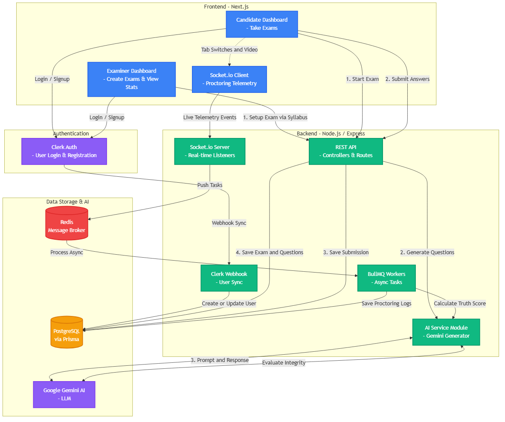

# Anti-Cheat Engine

**AI-Powered Online Examination and Proctoring Platform**

B.Tech Final Year Project | Author: Aditya Guha, Aditya Pandey, Bhavana Phartale & Sonu Kumar

---

## Abstract

The Anti-Cheat Engine is a full-stack, AI-driven online examination and proctoring platform designed to enforce academic integrity through real-time behavioral monitoring. The system automates the entire examination lifecycle — from AI-generated question paper creation to live proctoring and integrity scoring — eliminating the need for manual invigilation.

The platform integrates Google Gemini (LLM) for dynamic question generation and answer evaluation, Socket.io for real-time telemetry streaming, and BullMQ with Redis for asynchronous event processing. Each candidate submission is assigned a computed **Truth Score** (0–100) and a **Trust Label** (HIGH / MEDIUM / LOW) based on proctoring telemetry collected during the exam session.

---

## Core Functionality

The platform serves two distinct user roles: **Examiner** and **Candidate**.

### Examiner Module

- **AI-Driven Question Generation:** The examiner provides a syllabus, topic description, or raw content. The backend delegates this to the Gemini API, which generates a structured question set (MCQ, Text, Code) with difficulty ratings (EASY, MEDIUM, HARD). Generated questions are persisted in PostgreSQL via Prisma ORM.
- **Exam Configuration:** Supports configurable duration, proctoring toggle, scheduling (start/end dates), and access control (PUBLIC or PRIVATE with email-based invitations).
- **Automated Evaluation:** Submissions are auto-graded. The examiner receives per-candidate scores, grades, and integrity metrics without manual review.

### Candidate Module

- **Exam Environment:** Candidates take exams in a controlled browser environment with fullscreen enforcement.
- **Real-Time Proctoring:** The client-side proctoring module monitors and logs the following `ProctoringEvent` types:
  - `TAB_SWITCH` — Browser tab or window change detected.
  - `FULLSCREEN_EXIT` — Candidate exited fullscreen mode.
  - `MULTIPLE_FACES` — More than one face detected in the webcam feed.
  - `NO_FACE` — No face detected in the webcam feed.
  - `VOICE_DETECTED` — Audio input detected via microphone.
- **Telemetry Pipeline:** Events are streamed in real-time from the Next.js client via `socket.io-client` to the Express backend's Socket.io server. High-throughput events are offloaded to Redis and processed asynchronously by BullMQ workers to avoid blocking the main API thread.

### Integrity Scoring

Each `Submission` record includes:
- `score` (Float) — Technical performance metric.
- `grade` (String) — Computed letter grade (A, B, C, etc.).
- `truthScore` (Float, 0–100) — AI-computed integrity rating derived from proctoring telemetry.
- `trustLabel` (String) — Categorical label: HIGH, MEDIUM, or LOW.

---

## System Architecture

### Technology Stack

| Layer              | Technology                                           |
|--------------------|------------------------------------------------------|
| Frontend           | Next.js 16 (App Router), React 19, TypeScript        |
| UI Components      | Radix UI, Tailwind CSS, Framer Motion                |
| Backend            | Node.js, Express 5, TypeScript                       |
| Database           | PostgreSQL, Prisma ORM 7                             |
| AI / LLM           | Google Generative AI SDK (Gemini)                    |
| Real-Time          | Socket.io (client + server)                          |
| Message Queue      | Redis, BullMQ                                        |
| Authentication     | Clerk (frontend SDK + backend webhook sync via Svix) |

### Architecture Diagram



### Data Flow

1. **Authentication:** Users authenticate via Clerk on the Next.js frontend. Clerk dispatches a webhook (verified by Svix) to the Express backend, which upserts the user record into PostgreSQL with the assigned role (`EXAMINER` or `CANDIDATE`).

2. **Exam Creation:** The examiner submits exam parameters (syllabus, duration, access type) through the frontend. The backend's AI Service module constructs a structured prompt and sends it to the Gemini API. The response is parsed into `Question` records (with `type`, `options`, `correctAnswer`, `difficulty`) and persisted to the database.

3. **Exam Session and Proctoring:** When a candidate starts an exam, the frontend initializes the proctoring module. The client continuously monitors browser focus state, webcam feed, and audio input. Detected anomalies are emitted as Socket.io events to the backend server in real-time.

4. **Asynchronous Processing:** The Socket.io server pushes incoming telemetry events into a Redis-backed BullMQ queue. Worker processes consume these events asynchronously — writing `ProctoringEvent` and `TelemetryLog` records to the database without impacting API response times.

5. **Submission and Scoring:** Upon exam submission, candidate answers are evaluated against stored correct answers. The Truth Score is computed from the aggregate proctoring telemetry (event count, severity weighting), and the final `Submission` record is persisted with all computed metrics.

### Database Schema (Key Models)

| Model             | Purpose                                                        |
|-------------------|----------------------------------------------------------------|
| `User`            | Stores user profile, Clerk ID, role (EXAMINER / CANDIDATE)    |
| `Exam`            | Exam metadata, scheduling, access control, creator reference   |
| `Question`        | AI-generated questions with type, options, correct answer      |
| `Submission`      | Candidate attempt record with score, grade, and truth metrics  |
| `ProctoringEvent` | Individual proctoring violations with type, timestamp, severity|
| `Answer`          | Per-question candidate response with correctness and AI feedback|
| `TelemetryLog`    | Raw telemetry data (snapshots, events) stored as text payloads |
| `ExamInvite`      | Email-based access control for private exams                   |

---

## Project Structure

```
Anti-Cheat-Engine/
├── frontend/                   # Next.js 16 application
│   ├── app/                    # App Router pages and layouts
│   │   ├── dashboard/
│   │   │   ├── candidate/      # Candidate dashboard, exams, settings
│   │   │   └── examiner/       # Examiner dashboard, results, exam management
│   │   └── exam/[id]/          # Live exam-taking interface
│   ├── components/             # Reusable UI components (Radix, Tailwind)
│   ├── hooks/                  # Custom hooks (useApi, useProctoring, useExamSocket)
│   └── middleware.ts           # Clerk authentication middleware
│
├── backend/                    # Express.js API server
│   ├── src/
│   │   ├── config/             # Database (Prisma) and Redis configuration
│   │   ├── services/
│   │   │   ├── AI Generation/  # Gemini AI integration module
│   │   │   ├── candidate/      # Candidate routes, controllers, telemetry
│   │   │   ├── examiner/       # Examiner routes, controllers
│   │   │   └── middleware/     # Auth middleware (Clerk token + role verification)
│   │   ├── queues/             # BullMQ queue definitions
│   │   ├── socket/             # Socket.io event handlers
│   │   └── webhooks/           # Clerk webhook receiver
│   └── prisma/
│       ├── schema.prisma       # Database schema definition
│       ├── migrations/         # SQL migration history
│       └── seed.ts             # Database seed scripts
│
├── ai-worker/                  # Python worker (planned: CV/ML processing)
├── architecture_flowchart.png  # System architecture diagram
├── LICENSE.md                  # Proprietary license
└── README.md
```

---

## License

**All Rights Reserved. Proprietary and Confidential.**

This repository is published on GitHub exclusively for academic evaluation and portfolio demonstration as part of a B.Tech Final Year Project. No license is granted for use, modification, copying, distribution, or commercial exploitation of this codebase.

Unauthorized use may result in legal action. See [LICENSE.md](./LICENSE.md) for the full terms.